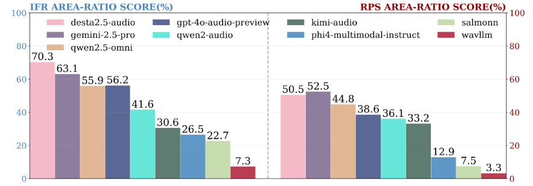

# ISA-Bench
ISA-Bench(Instruction Sensitivity of large Audio language models Benchmark):v1.0. 

## Main results

Two radar plots in (a) show the average IFR, and (b) presents the average RPS score across tasks


Normalized radar plot areas of different models (maxi-mum polygon area = 1). Left: IFR area; Right: RPS area.



IFR area-ratio score

| model                    | RPS AREA-RATIO SCORE (%) |
| ------------------------ | ------------------------ |
| desta2.5-audio           | 70.3                     |
| gemini2.5-pro            | 63.1                     |
| gpt-4o-audio-preview     | 56.2                     |
| qwen2.5-omni             | 55.9                     |
| qwen2-audio              | 41.6                     |
| kimi-audio               | 30.6                     |
| phi4-multimodal-instruct | 26.5                     |
| salmonn                  | 22.7                     |
| wavllm                   | 7.3                      |

RPS area-ratio score

| model                    | RPS AREA-RATIO SCORE (%) |
| ------------------------ | ------------------------ |
| gemini2.5-pro            | 52.5                     |
| desta2.5-audio           | 50.5                     |
| qwen2.5-omni             | 44.8                     |
| gpt-4o-audio-preview     | 38.6                     |
| qwen2-audio              | 36.1                     |
| kimi-audio               | 33.2                     |
| phi4-multimodal-instruct | 12.9                     |
| salmonn                  | 7.5                      |
| wavllm                   | 3.3                      |


## Detailed Results
We report the detailed results of ISA-Bench here. 

<details>
<summary>D Dimension</summary>


**Automatic speech recognition**

| ASR (IFR / WER_IF)  | desta2.5-audio | gemini-2.5-pro | qwen2.5_omni  | gpt-4o-audio-preview | qwen2_audio   | kimi-audio    | phi4-multimodal-instruct | salmonn       | wavllm        |
| ------------------- | -------------- | -------------- | ------------- | -------------------- | ------------- | ------------- | ------------------------ | ------------- | ------------- |
| default             | 93.09 / 43.14  | 98.13 / 28.83  | 30.88 / 85.86 | 93.93 / 13.03        | 93.4 / 10.4   | 2.21 / 97.89  | 28.78 / 70.31            | 40.11 / 64.42 | 14.89 / 87.45 |
| case                | 85.29 / 45.49  | 98.03 / 27.7   | 30.36 / 90.48 | 94.45 / 14.75        | 93.99 / 9.07  | 4.45 / 96.46  | 37.02 / 62.85            | 63.24 / 41.28 | 14.39 / 88.65 |
| robustness          | 68.42 / 49.56  | 95.86 / 20.91  | 32.86 / 87.65 | 90.78 / 16.51        | 84.52 / 19.39 | 6.22 / 94.99  | 22.86 / 76.81            | 58.78 / 46.06 | 8.11 / 93.83  |
| semantic complexity | 93.5 / 26.78   | 96.92 / 14.77  | 31.69 / 83.1  | 81.37 / 21.21        | 93.88 / 9.95  | 10.06 / 91.43 | 27.66 / 72.02            | 50.19 / 61.35 | 16.32 / 86.52 |
| punctuation         | 91.6 / 38.93   | 95.73 / 25.51  | 30.52 / 83.0  | 93.55 / 15.0         | 90.23 / 13.73 | 3.28 / 96.98  | 41.72 / 57.59            | 32.91 / 73.5  | 13.63 / 88.36 |

**Speech emotion recognition**

| SER (IFR / ACC_IF)  | desta2.5-audio | gemini-2.5-pro | qwen2.5_omni  | gpt-4o-audio-preview | qwen2_audio   | kimi-audio    | phi4-multimodal-instruct | salmonn       | wavllm        |
| ------------------- | -------------- | -------------- | ------------- | -------------------- | ------------- | ------------- | ------------------------ | ------------- | ------------- |
| default             | 97.58 / 70.83  | 95.41 / 63.09  | 95.89 / 61.8  | 81.22 / 48.67        | 99.76 / 64.87 | 94.2 / 74.62  | 74.21 / 34.33            | 91.54 / 36.66 | 81.79 / 48.67 |
| case                | 94.56 / 68.05  | 96.62 / 64.75  | 51.53 / 33.84 | 82.07 / 49.44        | 99.8 / 63.34  | 93.8 / 74.58  | 78.65 / 37.47            | 84.17 / 35.25 | 73.33 / 41.86 |
| robustness          | 76.83 / 56.16  | 91.7 / 61.48   | 49.64 / 33.28 | 61.24 / 37.23        | 99.07 / 64.63 | 94.0 / 74.54  | 42.26 / 19.34            | 64.71 / 26.39 | 62.89 / 37.71 |
| semantic complexity | 88.24 / 64.09  | 82.27 / 55.31  | 85.58 / 54.41 | 76.42 / 44.94        | 98.17 / 62.02 | 85.39 / 68.25 | 67.5 / 30.81             | 38.4 / 14.79  | 71.02 / 42.03 |
| punctuation         | 98.39 / 71.8   | 98.63 / 66.72  | 94.55 / 60.55 | 82.51 / 50.44        | 99.84 / 65.67 | 94.76 / 75.58 | 84.05 / 37.87            | 72.62 / 28.15 | 79.53 / 48.75 |

**Gender recognition**

| GR (IFR / ACC_IF)   | desta2.5-audio | gemini-2.5-pro | qwen2.5_omni  | gpt-4o-audio-preview | qwen2_audio   | kimi-audio    | phi4-multimodal-instruct | salmonn       | wavllm        |
| ------------------- | -------------- | -------------- | ------------- | -------------------- | ------------- | ------------- | ------------------------ | ------------- | ------------- |
| default             | 100.0 / 89.96  | 99.81 / 82.06  | 99.96 / 62.21 | - / -                | 100.0 / 89.24 | 99.96 / 92.75 | 91.98 / 58.78            | 99.39 / 60.76 | 4.08 / 1.98   |
| case                | 100.0 / 89.26  | 99.9 / 82.65   | 74.31 / 46.89 | - / -                | 100.0 / 88.49 | 99.96 / 93.02 | 96.95 / 58.05            | 98.68 / 57.08 | 26.43 / 12.71 |
| robustness          | 90.25 / 79.62  | 99.26 / 81.73  | 80.88 / 47.52 | - / -                | 99.29 / 86.83 | 99.92 / 93.7  | 81.64 / 46.77            | 93.21 / 49.47 | 1.64 / 0.95   |
| semantic complexity | 95.58 / 84.15  | 99.8 / 81.55   | 99.37 / 60.32 | - / -                | 100.0 / 87.52 | 99.95 / 92.39 | 96.49 / 59.68            | 98.68 / 57.23 | 48.82 / 23.17 |
| punctuation         | 100.0 / 89.16  | 99.92 / 82.44  | 99.79 / 61.41 | - / -                | 100.0 / 89.54 | 100.0 / 92.75 | 93.36 / 59.47            | 99.66 / 61.26 | 5.95 / 2.82   |

**Speech-to-text translation**

| S2TT (IFR / BLEU_IF) | desta2.5-audio | gemini-2.5-pro | qwen2.5_omni  | gpt-4o-audio-preview | qwen2_audio   | kimi-audio | phi4-multimodal-instruct | salmonn    | wavllm       |
| -------------------- | -------------- | -------------- | ------------- | -------------------- | ------------- | ---------- | ------------------------ | ---------- | ------------ |
| default              | 81.33 / 21.44  | 90.22 / 39.22  | 87.77 / 36.6  | 92.22 / 37.98        | 66.42 / 22.16 | - / -      | 11.45 / 0.02             | 0.34 / 0.0 | 31.74 / 6.49 |
| case                 | 82.15 / 22.16  | 90.56 / 39.15  | 60.46 / 16.41 | 90.41 / 37.45        | 68.13 / 23.38 | - / -      | 18.27 / 0.86             | 1.29 / 0.0 | 30.39 / 5.49 |
| robustness           | 36.44 / 4.88   | 86.7 / 35.17   | 54.31 / 8.95  | 85.34 / 33.41        | 57.8 / 14.72  | - / -      | 13.48 / 0.06             | 1.48 / 0.0 | 17.88 / 0.64 |
| semantic complexity  | 73.64 / 18.34  | 92.36 / 32.2   | 85.51 / 34.22 | 88.19 / 36.29        | 61.7 / 19.52  | - / -      | 10.85 / 0.1              | 5.45 / 0.0 | 36.7 / 7.15  |
| punctuation          | 77.86 / 20.74  | 90.5 / 39.26   | 80.16 / 33.0  | 91.73 / 37.88        | 57.39 / 16.7  | - / -      | 13.21 / 0.05             | 0.3 / 0.0  | 28.91 / 3.25 |

**Audio captioning**

| AAC (IFR / METEOR_IF) | desta2.5-audio | gemini-2.5-pro | qwen2.5_omni   | gpt-4o-audio-preview | qwen2_audio    | kimi-audio    | phi4-multimodal-instruct | salmonn        | wavllm |
| --------------------- | -------------- | -------------- | -------------- | -------------------- | -------------- | ------------- | ------------------------ | -------------- | ------ |
| default               | 78.42 / 0.1183 | 95.44 / 0.1311 | 27.59 / 0.0543 | 98.76 / 0.1129       | 64.11 / 0.1179 | 4.67 / 0.0073 | 43.15 / 0.0623           | 43.46 / 0.013  | - / -  |
| case                  | 67.33 / 0.1    | 90.66 / 0.13   | 32.89 / 0.07   | 98.91 / 0.12         | 60.01 / 0.11   | 5.39 / 0.01   | 37.61 / 0.06             | 42.06 / 0.01   | - / -  |
| robustness            | 66.29 / 0.1    | 93.05 / 0.13   | 33.2 / 0.07    | 95.85 / 0.11         | 52.34 / 0.09   | 5.08 / 0.01   | 32.16 / 0.05             | 39.94 / 0.01   | - / -  |
| semantic complexity   | 81.05 / 0.1    | 95.4 / 0.11    | 40.77 / 0.08   | 97.86 / 0.11         | 73.14 / 0.13   | 13.45 / 0.03  | 36.65 / 0.06             | 63.31 / 0.01   | - / -  |
| punctuation           | 80.71 / 0.122  | 93.67 / 0.1294 | 20.02 / 0.0405 | 97.1 / 0.114         | 55.29 / 0.1017 | 4.05 / 0.0069 | 59.96 / 0.0869           | 36.31 / 0.0119 | - / -  |


**Legend**


**D Dimension (Description) - All Tasks Comparison**

- AAC

  

- ASR

  

- GR

  

- S2TT

  

- SER

  


</details>

<details>
<summary>F Dimension</summary>

**Automatic speech recognition**

| ASR (IFR / WER_IF) | desta2.5-audio | gemini-2.5-pro | qwen2.5_omni  | gpt-4o-audio-preview | qwen2_audio   | kimi-audio    | phi4-multimodal-instruct | salmonn       | wavllm        |
| ------------------ | -------------- | -------------- | ------------- | -------------------- | ------------- | ------------- | ------------------------ | ------------- | ------------- |
| constrain          | 97.79 / 7.71   | 99.31 / 2.69   | 88.13 / 14.27 | 96.72 / 5.18         | 68.66 / 37.09 | 97.79 / 3.29  | 99.81 / 1.92             | 97.21 / 4.03  | 99.2 / 3.02   |
| case               | 99.35 / 5.15   | 99.39 / 2.54   | 98.34 / 10.13 | 98.88 / 4.92         | 66.39 / 43.43 | 6.17 / 92.5   | 50.74 / 50.12            | 40.52 / 62.33 | 60.95 / 43.46 |
| decoration         | 84.46 / 20.46  | 98.65 / 3.84   | 69.86 / 40.97 | 91.5 / 12.76         | 52.58 / 53.86 | 3.0 / 97.57   | 2.0 / 98.16              | 10.49 / 93.01 | 14.57 / 92.97 |
| json               | 99.39 / 3.81   | 4.12 / 95.87   | 99.66 / 4.02  | 96.56 / 4.89         | 0.19 / 99.86  | 11.15 / 88.35 | 85.61 / 44.49            | 12.4 / 93.57  | 0.0 / 100.0   |

**Speech emotion recognition**

| SER (IFR / ACC_IF) | desta2.5-audio | gemini-2.5-pro | qwen2.5_omni  | gpt-4o-audio-preview | qwen2_audio   | kimi-audio    | phi4-multimodal-instruct | salmonn       | wavllm        |
| ------------------ | -------------- | -------------- | ------------- | -------------------- | ------------- | ------------- | ------------------------ | ------------- | ------------- |
| constrain          | 89.52 / 65.03  | 92.67 / 60.92  | 89.93 / 57.94 | 52.22 / 32.07        | 100.0 / 63.9  | 94.2 / 75.58  | 57.53 / 29.09            | 99.19 / 39.32 | 16.68 / 9.35  |
| case               | 97.47 / 66.68  | 97.34 / 63.58  | 99.4 / 53.78  | 97.3 / 58.02         | 96.25 / 54.27 | 99.44 / 78.04 | 94.93 / 41.86            | 49.67 / 24.9  | 26.59 / 13.38 |
| decoration         | 82.84 / 59.2   | 94.28 / 61.99  | 60.62 / 36.72 | 76.85 / 44.08        | 18.51 / 9.77  | 13.4 / 10.16  | 37.47 / 14.88            | 19.39 / 7.89  | 3.65 / 2.12   |
| json               | 96.7 / 68.9    | 0.24 / 0.16    | 99.44 / 63.9  | 90.09 / 52.94        | 0.81 / 0.48   | 46.58 / 35.94 | 98.47 / 50.04            | 66.88 / 27.07 | 0.0 / 0.0     |

**Gender recognition**

| GR (IFR / ACC_IF) | desta2.5-audio | gemini-2.5-pro | qwen2.5_omni  | gpt-4o-audio-preview | qwen2_audio   | kimi-audio    | phi4-multimodal-instruct | salmonn       | wavllm      |
| ----------------- | -------------- | -------------- | ------------- | -------------------- | ------------- | ------------- | ------------------------ | ------------- | ----------- |
| constrain         | 91.41 / 82.33  | 97.52 / 81.03  | 69.77 / 49.62 | - / -                | 100.0 / 89.62 | 100.0 / 93.13 | 77.71 / 50.53            | 99.81 / 60.38 | 4.54 / 2.21 |
| case              | 97.27 / 84.97  | 99.47 / 83.95  | 99.81 / 66.7  | - / -                | 97.08 / 74.31 | 100.0 / 91.73 | 94.18 / 57.45            | 50.99 / 28.08 | 4.16 / 1.98 |
| decoration        | 84.68 / 73.94  | 96.26 / 79.71  | 53.26 / 36.25 | - / -                | 37.52 / 27.72 | 29.0 / 27.09  | 38.66 / 19.96            | 5.49 / 2.55   | 1.65 / 0.8  |
| json              | 87.6 / 77.02   | 0.11 / 0.08    | 94.35 / 65.5  | - / -                | 0.08 / 0.04   | 80.38 / 76.03 | 99.69 / 65.42            | 27.37 / 14.24 | 0.0 / 0.0   |

**Speech-to-text translation**

| S2TT (IFR / BLEU_IF) | desta2.5-audio | gemini-2.5-pro | qwen2.5_omni  | gpt-4o-audio-preview | qwen2_audio   | kimi-audio | phi4-multimodal-instruct | salmonn      | wavllm        |
| -------------------- | -------------- | -------------- | ------------- | -------------------- | ------------- | ---------- | ------------------------ | ------------ | ------------- |
| constrain            | 86.67 / 25.81  | 95.71 / 41.49  | 96.11 / 42.95 | 96.73 / 40.97        | 81.11 / 30.92 | - / -      | 94.0 / 43.71             | 98.65 / 34.2 | 95.89 / 29.89 |
| case                 | - / -          | - / -          | - / -         | - / -                | - / -         | - / -      | - / -                    | - / -        | - / -         |
| decoration           | 73.06 / 21.83  | 96.37 / 41.67  | 67.63 / 27.4  | 92.2 / 38.67         | 44.49 / 13.34 | - / -      | 1.66 / 0.0               | 5.43 / 0.0   | 15.33 / 1.33  |
| json                 | 29.8 / 0.73    | 3.32 / 0.0     | 82.68 / 35.28 | 93.91 / 39.69        | 0.03 / 0.0    | - / -      | 3.53 / 0.0               | 0.27 / 0.0   | 0.0 / 0.0     |

**Audio captioning**

| AAC (IFR / METEOR_IF) | desta2.5-audio | gemini-2.5-pro | qwen2.5_omni   | gpt-4o-audio-preview | qwen2_audio    | kimi-audio     | phi4-multimodal-instruct | salmonn        | wavllm |
| --------------------- | -------------- | -------------- | -------------- | -------------------- | -------------- | -------------- | ------------------------ | -------------- | ------ |
| constrain             | 75.1 / 0.1119  | 69.29 / 0.0978 | 71.27 / 0.1495 | 56.12 / 0.0586       | 68.26 / 0.1235 | 100.0 / 0.1819 | 0.41 / 0.0002            | 65.87 / 0.136  | - / -  |
| case                  | 91.13 / 0.1    | 92.84 / 0.13   | 84.13 / 0.14   | 96.32 / 0.1          | 57.47 / 0.07   | 54.3 / 0.09    | 1.5 / 0.0                | 47.41 / 0.06   | - / -  |
| decoration            | 73.24 / 0.11   | 96.19 / 0.14   | 67.22 / 0.14   | 91.46 / 0.1          | 47.65 / 0.07   | 3.15 / 0.0     | 16.56 / 0.02             | 33.47 / 0.03   | - / -  |
| json                  | 95.75 / 0.1517 | 0.83 / 0.0013  | 98.03 / 0.2113 | 83.92 / 0.0993       | 11.2 / 0.0212  | 66.29 / 0.1344 | 95.12 / 0.155            | 17.84 / 0.0051 | - / -  |


**Legend**


**F Dimension (Format) - All Tasks Comparison**

- AAC

  

- ASR

  

- GR

  

- S2TT

  

- SER

  


</details>


<details>

<summary>N Dimension</summary>

**Automatic speech recognition**
| ASR (IFR / WER_IF) | desta2.5-audio | gemini-2.5-pro | qwen2.5_omni  | gpt-4o-audio-preview | qwen2_audio   | kimi-audio    | phi4-multimodal-instruct | salmonn       | wavllm      |
| ------------------ | -------------- | -------------- | ------------- | -------------------- | ------------- | ------------- | ------------------------ | ------------- | ----------- |
| 2-task-separator   | 67.19 / 44.54  | 90.01 / 21.11  | 91.72 / 20.5  | - / -                | 30.53 / 76.96 | 79.27 / 31.96 | 13.53 / 89.7             | 15.23 / 86.85 | 0.0 / 100.0 |
| 3-task-separator   | 65.23 / 45.01  | 91.28 / 20.37  | 91.21 / 20.83 | - / -                | 36.73 / 73.92 | 67.19 / 45.52 | 4.61 / 96.8              | 55.94 / 58.04 | 0.0 / 100.0 |
| 2-task-json        | 78.51 / 31.16  | 3.1 / 96.9     | 85.9 / 23.73  | - / -                | 0.7 / 99.4    | 58.09 / 48.55 | 91.02 / 19.96            | 6.95 / 94.4   | 0.0 / 100.0 |
| 3-task-json        | 86.41 / 23.4   | 0.63 / 99.24   | 91.4 / 18.59  | - / -                | 0.06 / 99.93  | 78.19 / 31.15 | 91.59 / 18.37            | 37.8 / 70.94  | 0.0 / 100.0 |


**Speech emotion recognition**
| SER (IFR / ACC_IF) | desta2.5-audio | gemini-2.5-pro | qwen2.5_omni  | gpt-4o-audio-preview | qwen2_audio   | kimi-audio    | phi4-multimodal-instruct | salmonn       | wavllm      |
| ------------------ | -------------- | -------------- | ------------- | -------------------- | ------------- | ------------- | ------------------------ | ------------- | ----------- |
| 2-task-separator   | 76.23 / 53.86  | 92.23 / 60.49  | 85.4 / 56.07  | - / -                | 42.23 / 23.7  | 50.0 / 37.74  | 25.22 / 11.57            | 37.55 / 13.65 | 0.32 / 0.13 |
| 3-task-separator   | 67.19 / 49.05  | 89.57 / 58.03  | 76.04 / 49.37 | - / -                | 30.97 / 16.94 | 39.13 / 27.81 | 15.17 / 6.89             | 20.23 / 7.65  | 0.0 / 0.0   |
| 2-task-json        | 93.49 / 67.89  | 2.21 / 1.45    | 95.39 / 63.84 | - / -                | 4.61 / 2.53   | 81.61 / 61.31 | 90.64 / 44.69            | 34.13 / 14.35 | 0.0 / 0.0   |
| 3-task-json        | 88.62 / 64.03  | 2.34 / 1.83    | 91.97 / 58.03 | - / -                | 0.13 / 0.06   | 84.83 / 60.49 | 92.48 / 46.02            | 41.91 / 18.77 | 0.0 / 0.0   |


**Gender recognition**
| GR (IFR / ACC_IF) | desta2.5-audio | gemini-2.5-pro | qwen2.5_omni  | gpt-4o-audio-preview | qwen2_audio   | kimi-audio    | phi4-multimodal-instruct | salmonn       | wavllm    |
| ----------------- | -------------- | -------------- | ------------- | -------------------- | ------------- | ------------- | ------------------------ | ------------- | --------- |
| 2-task-separator  | 72.95 / 70.8   | 93.3 / 90.39   | 85.34 / 79.77 | - / -                | 40.52 / 39.63 | 45.32 / 42.86 | 10.68 / 7.02             | 34.96 / 26.86 | 0.0 / 0.0 |
| 3-task-separator  | 63.97 / 62.83  | 90.39 / 87.23  | 74.21 / 69.97 | - / -                | 29.33 / 28.19 | 34.7 / 32.68  | 10.62 / 6.19             | 18.33 / 12.9  | 0.0 / 0.0 |
| 2-task-json       | 92.04 / 90.58  | 2.53 / 2.53    | 95.95 / 93.36 | - / -                | 1.96 / 1.96   | 70.35 / 69.22 | 90.64 / 52.53            | 40.9 / 34.01  | 0.0 / 0.0 |
| 3-task-json       | 87.74 / 85.97  | 2.53 / 2.47    | 92.6 / 89.95  | - / -                | 0.19 / 0.19   | 73.26 / 71.74 | 89.95 / 50.44            | 51.45 / 41.66 | 0.0 / 0.0 |


**N Dimension Comparison**

- Combined Legend

  

- ASR Multi-Model Comparison

  

- GR Multi-Model Comparison

  

- SER Multi-Model Comparison

  

</details>

environment setup

``` bash
# conda environment setup
conda create -n isa_bench python=3.12
conda activate isa_bench
pip install torch==2.7.1 torchvision==0.22.1 torchaudio==2.7.1 --index-url https://download.pytorch.org/whl/cu118
pip install jiwer regex more_itertools sacrebleu jieba aac_metrics
conda install -c conda-forge openjdk=11.0.27
```

Run a specific metric on a certain task of one dimension

``` bash
# example: asr task of d dimension
cd code
export PYTHONPATH=$PWD:$PYTHONPATH
python metric.py --dim d --task asr --input <model_name>/d/<model_name>_asr_results.json
```
Calculate the metrics and score the model on ISA-Bench 

``` bash
cd code
export PYTHONPATH=$PWD:$PYTHONPATH
# modify the model_name parameter in score_all.sh script
bash score_all.sh
```

## Citation
```latex
@misc{li2025isabenchbenchmarkinginstructionsensitivity,
      title={ISA-Bench: Benchmarking Instruction Sensitivity for Large Audio Language Models}, 
      author={Bohan Li and Wenbin Huang and Yuhang Qiu and Yiwei Guo and Hankun Wang and Zhihan Li and Jing Peng and Ziyang Ma and Xie Chen and Kai Yu},
      year={2025},
      eprint={2510.23558},
      archivePrefix={arXiv},
      primaryClass={cs.SD},
      url={https://arxiv.org/abs/2510.23558}, 
}
```
